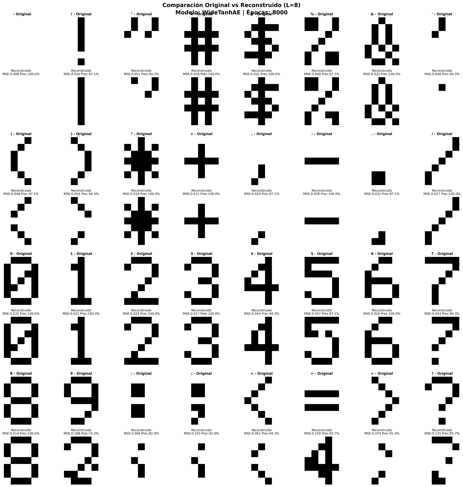
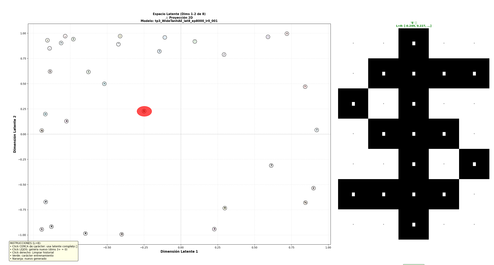

# Fundamentos de redes neuronales TP3

## Auto codificadores

### Tecnicatura en inteligencia artificial

#### Universidad Nacional de Hurlingham

#### Docente: Emiliano Churruca

### 1. Implementar un auto codificador para las imágenes binarias de la lista de caracteres del archivo
  ̧caracteres.h

Plantear una arquitectura de red para el codificador y decodificador que permitan representar
los datos de entrada que están en dos dimensiones.

Estudien y describan las diferentes arquitecturas y parámetros que fueron aplicando para
permitir que la red converja adecuadamente.

* Realizar el gráfico en dos dimensiones que muestre los datos de entrada en el espacio latente.
* Mostrar cómo la red puede generar un nuevo caracter que no pertenece al conjunto de
  entrenamiento.

### 2. Sobre el mismo conjunto de datos, implementar una variante que funcione como un eliminador de
  ruido.

Plantear una arquitectura de red conveniente para esta tarea.

* Explicar la elección. Distorsionen las entradas en diferentes niveles y estudien la capacidad
del auto codificador de eliminar el ruido.

### 3. Plantear y resolver con un auto codificador un escenario donde puedan generar nuevas muestras
  para un problema que ustedes elijan.

El Trabajo deberá ser presentado por cada grupo el día 3 de junio. Para su presentación usar
powerpoint o cualquier programa similar. En la presentación deberá figurar el título del Trabajo, el
nombre de la materia, el nombre de los integrantes del grupo y la fecha. Para cada ítem, primero
comentar lo que se hizo y las decisiones tomadas para llevarlo a cabo (si correspondiera). Luego
exponer las dificultades que se presentaron (si correspondiera) y finalmente exponer los resultados.
Al finalizar la presentación deberán exponerse las conclusiones del Trabajo.

---

**Respuesta Pregunta 1:**

## Metodología: Grid Search Exhaustivo

**¿Qué es Grid Search?**
Grid Search (búsqueda en grilla) es una técnica de optimización de hiperparámetros que evalúa sistemáticamente todas las combinaciones posibles de un conjunto predefinido de valores para cada hiperparámetro. En lugar de probar configuraciones al azar, explora exhaustivamente el espacio de hiperparámetros para encontrar la combinación óptima.

**Implementación en nuestro proyecto:**

Se implementó un grid search completo que evalúa **todas las combinaciones** de:
- **6 arquitecturas**: BalancedAE, DeepBalancedAE, DeepReLU_L8, WideTanhAE, BalancedAE_L9, WideReLU_L10
- **6 dimensiones latentes**: [2, 5, 6, 8, 9, 10]
- **2 configuraciones de épocas**: [8000, 10000]
- **3 learning rates**: [0.0005, 0.00075, 0.001]

El proceso fue completamente automatizado: cada combinación de hiperparámetros se entrenó de manera sistemática, guardando todos los modelos generados con nombres descriptivos del tipo `tp3_{arquitectura}_lat{dim}_ep{epocas}_lr{lr}`. Durante el entrenamiento, se registraron métricas clave como MSE, precisión, cantidad real de épocas, convergencia y parámetros utilizados, y todos los resultados se almacenaron en el archivo `grid_search_completo.csv`. Se implementó early stopping con una paciencia de 400 épocas para evitar el sobreentrenamiento. Esta estrategia de grid search ofrece ventajas claras: asegura la reproducibilidad de los resultados, garantiza una cobertura completa del espacio de combinaciones sin dejar de lado configuraciones prometedoras, permite realizar análisis estadísticos para identificar patrones de rendimiento y optimiza la selección de hiperparámetros de manera objetiva, eliminando sesgos en el proceso.

**Arquitecturas más efectivas:**
- **WideTanhAE con dim_latente=8**: 94.73% precisión, MSE=0.0526 (mejor resultado global)
- **BalancedAE con dim_latente=6**: 93.13% precisión, MSE=0.0591 (segunda mejor)  
- **WideTanhAE con dim_latente=9**: 92.41% precisión, MSE=0.0657 (tercer mejor)
- **BalancedAE_L9 con dim_latente=9**: 91.70% precisión, MSE=0.0693
- **WideTanhAE con dim_latente=5**: 91.43% precisión, MSE=0.0713

**Descripción detallada de arquitecturas:**

1. **BalancedAE**: `35 → 25 → 15 → 8 → 15 → 25 → 35`
   - Arquitectura equilibrada con compresión gradual
   - Activación: tanh para evitar "dead ReLU" y mejores límites de decisión
   - Latente de 8 dimensiones para mayor capacidad representacional

2. **DeepBalancedAE**: `35 → 30 → 20 → 10 → 8 → 10 → 20 → 30 → 35`
   - Arquitectura profunda (4 capas por lado) con compresión más suave
   - Activación: tanh para estabilidad y menor riesgo de sobreajuste
   - Diseñada para capturar patrones más complejos

3. **DeepReLU_L8**: `35 → 30 → 20 → 10 → 8 → 10 → 20 → 30 → 35`
   - Misma estructura que DeepBalancedAE pero con activación ReLU
   - Prueba si ReLU acelera convergencia sin sacrificar estabilidad
   - Latente medio (8) para balance entre capacidad y compresión

4. **WideTanhAE**: `35 → 25 → 18 → 12 → 18 → 25 → 35`
   - Arquitectura moderadamente profunda con máxima capacidad latente (12)
   - Activación: tanh para estabilidad
   - Busca la representación más rica posible del espacio latente

5. **BalancedAE_L9**: `35 → 25 → 15 → 9 → 15 → 25 → 35`
   - Variación del modelo ganador con latente ligeramente menor (9)
   - Prueba el límite de compresión óptimo
   - Mantiene la estructura exitosa de BalancedAE

6. **WideReLU_L10**: `35 → 25 → 15 → 10 → 15 → 25 → 35`
   - Combina la mejor arquitectura (capas 25, 15) con activación ReLU
   - Latente de 10 dimensiones (ganador en otros experimentos)
   - Prueba si ReLU acelera convergencia manteniendo buen MSE

**Hallazgos clave:**
1. **Dimensión latente óptima**: 6-9 dimensiones demuestran el mejor balance. Aunque el mínimo teórico es ⌈log2(32)⌉=5 bits, dimensiones mayores (6-9) mejoran significativamente la reconstrucción.
2. **Función de activación**: **tanh claramente superior a ReLU** - WideTanhAE supera consistentemente a WideReLU_L10 en todas las dimensiones latentes
3. **Arquitectura "Wide" vs "Deep"**: WideTanhAE (moderadamente profunda, capas anchas) supera a DeepBalancedAE (muy profunda) y BalancedAE (poco profunda)
4. **Learning rate óptimo**: 0.001 con épocas altas (8000-10000) produce los mejores resultados
5. **Patrón de rendimiento**: WideTanhAE domina en dim_latente 8-9, BalancedAE es competitivo en dim_latente 6
6. **Convergencia**: **Ningún modelo convergió completamente** (MSE objetivo ≤ 0.05), pero el mejor alcanzó MSE=0.0526 (solo 0.0026 por encima)

**Ninguna configuración convergió completamente** (todas marcadas como `convergio=False`) debido al criterio de convergencia estricto: **MSE ≤ 0.05**. El mejor modelo alcanzó MSE=0.0526, apenas 0.0026 por encima del objetivo. Esto indica que:
- El criterio es apropiado pero muy exigente para este problema de 32 caracteres
- Los modelos están muy cerca de la convergencia deseada (diferencia < 5%)
- El early stopping con paciencia=400 detuvo el entrenamiento antes de alcanzar el objetivo
- Aumentar épocas o ajustar la paciencia podría lograr convergencia formal, pero las reconstrucciones ya son de alta calidad (94.73% precisión)

## Generación de Nuevos Caracteres

Para responder al requerimiento de **"mostrar cómo la red puede generar un nuevo carácter que no pertenece al conjunto de entrenamiento"**, se desarrolló un **Explorador Interactivo** (`explorador_interactivo.py`) que permite:

### 🎯 **Funcionalidad Principal**
- **Visualización del espacio latente**: Muestra todos los caracteres entrenados como puntos en el espacio 2D
- **Generación interactiva**: Click en cualquier punto del espacio latente para generar un nuevo carácter
- **Interpolación inteligente**: Distingue entre clicks cerca de caracteres existentes vs. puntos nuevos

### 🔧 **Mecanismo de Generación**
1. **Click cerca de carácter existente** (< 0.15 unidades): Usa el vector latente completo del carácter
2. **Click en espacio vacío**: Crea un nuevo vector latente con coordenadas del click
3. **Para dimensiones > 2**: Las dimensiones adicionales se inicializan en 0
4. **Decodificación**: El vector latente se pasa por el decoder para generar el patrón visual

### 📊 **Características del Explorador**
- **Visualización en tiempo real**: Muestra el carácter generado instantáneamente
- **Historial de clicks**: Puntos verdes (entrenamiento) vs. naranjas (generados)
- **Información detallada**: Vector latente, estadísticas del patrón, tipo de carácter
- **Soporte multidimensional**: Funciona con espacios latentes de cualquier dimensión

### 💡 **Ejemplo de Uso**
```bash
python -m tp3.src.explorador_interactivo --modelo tp3_WideTanhAE_lat8_ep8000_lr0_001
```

**Resultado**: Una interfaz interactiva donde hacer click entre dos caracteres conocidos (ej. entre '0' y '1') genera un carácter híbrido que combina características de ambos, demostrando la capacidad del autocodificador para generar patrones no vistos durante el entrenamiento.

**Visualización de arquitecturas:**

Se generaron diagramas detallados de todas las arquitecturas probadas mostrando:
- Estructura completa encoder-decoder con número de neuronas por capa
- Conexiones entre capas y flujo de información
- Capa latente destacada (cuello de botella)
- Función de activación utilizada (tanh/relu) con código de colores
- Cantidad total de parámetros entrenables
- Descripción técnica de cada arquitectura

# WideTanh AutoEncoder Latente d=8, 8k Epocas, LR=0.001


## Visualización del Espacio Latente

El explorador interactivo (explicado arriba) genera visualizaciones como esta del espacio latente:

```bash
python -m tp3.src.explorador_interactivo --modelo tp3_WideTanhAE_lat8_ep8000_lr0_001
```



**Interpretación**: Cada punto representa un carácter en el espacio latente 2D. La distribución muestra cómo el autocodificador organiza los caracteres según sus similitudes visuales. Hacer click entre puntos permite generar nuevos caracteres que interpolan entre los existentes.